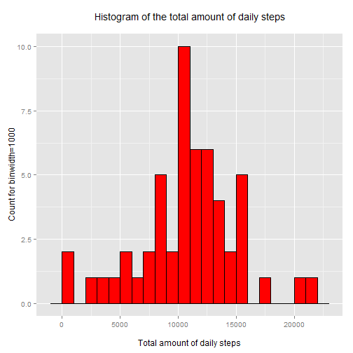
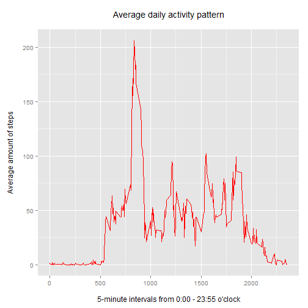
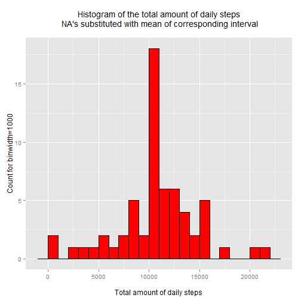
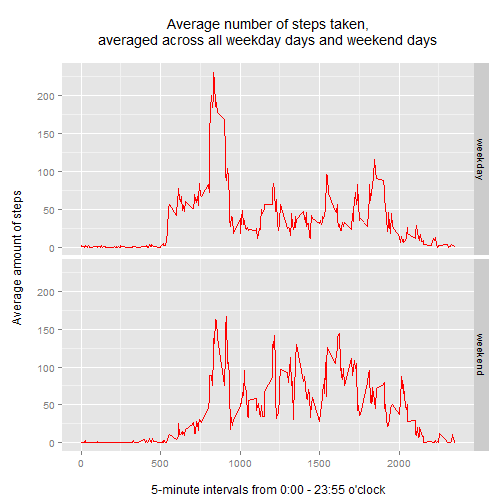

&nbsp;

## Prerequisites
Please make sure, that for this analysis the R-libraries **dplyr** and **ggplot2** are installed.  
First the above mentioned libraries are loaded.


```r
library(dplyr)
library(ggplot2)
```
&nbsp;

## Loading and preprocessing the data
For loading the data, the datafile **activity.zip** should be present in the current working directory.
  
If this is the case, the data can be unzipped and loaded into the dataframe `dat`.


```r
#Define filenames
zipfile <- "./activity.zip"
datfile <- "./activity.csv"

##Unzip and load data-file
unzip(zipfile)
dat <- read.csv(datfile)
```
&nbsp;

The first 6 rows of the dataframe `dat` look like this:

```r
head(dat)
```

```
##   steps       date interval
## 1    NA 2012-10-01        0
## 2    NA 2012-10-01        5
## 3    NA 2012-10-01       10
## 4    NA 2012-10-01       15
## 5    NA 2012-10-01       20
## 6    NA 2012-10-01       25
```
&nbsp;  
  
Now the column `date` is converted to the data-type `Date`, which is useful for further processing.

```r
dat$date <- as.Date(dat$date) 
```
&nbsp;  
  
## What is mean total number of steps taken per day?

To answer this question, first the total number of steps taken per day are calculated. NA-values should be ignored. Therefore all NA-values are filtered out, before grouping the data per day and summing up the steps.


```r
steps.per.date <- 
    dat %>%
    filter(!is.na(steps)) %>%
    group_by(date) %>%
    summarize(total=sum(steps))
```
&nbsp;

Second a histogram shows the total number of steps taken each day.


```r
qplot(total, 
      data=steps.per.date, 
      geom="histogram", 
      binwidth=1000, 
      fill=I("red"), 
      col=I("black"),
      main="Histogram of the total amount of daily steps\n",
      xlab="\nTotal amount of daily steps",
      ylab="Count for binwidth=1000")
```

 

The mean and the median of the steps over all days is shown below.

```r
mean(steps.per.date$total)
```

[1] 10766.19

```r
median(steps.per.date$total)
```

[1] 10765
&nbsp;

## What is the average daily activity pattern?

To answer this question, first a dataframe grouped by interval with the average value (mean) of steps across all days for this particular interval has to be calculated.


```r
steps.per.interval <- 
    dat %>%
    filter(!is.na(steps)) %>%
    group_by(interval) %>%
    summarize(mean=mean(steps))
```
&nbsp;

Based on this, a time-series plot can be produced. The time-series plot shows a 5-minute interval (x-axis) and the average number of steps taken, averaged across all days (y-axis).


```r
qplot(x=interval, 
      y=mean, 
      data=steps.per.interval, 
      geom="line", 
      col=I("red"),
      main="Average daily activity pattern\n",
      xlab="\n5-minute intervals from 0:00 - 23:55 o'clock",
      ylab="Average amount of steps\n")
```

 
&nbsp;

Now the 5-min-interval with the maximum average-number of steps is calculated:

```r
maxInterval <- filter(steps.per.interval, mean==max(mean))
```
The interval with the maximum average steps is interval **`835`** which counts in average **`206.1698113`** steps.
&nbsp;

## Imputing missing values

In the given dataset several NA-values are present in the column **steps**. More precisely speaken, there are some complete days of missing activity data, which are currently represented by NA's. There are no days only with partly missing activity data.

The NA-values should be substituted. For this, first the amount of NA-values in the dataset is calculated.


```r
countNA <- sum(!complete.cases(dat))  
```

Currently there are **`2304`** NA-values in the dataset.  

The NA-values present in the column **steps** for each day/interval will be substituted by the average (mean) of the corresponding interval across all the days having data for that particular interval.

For doing this, a new dataframe is calculated.

```r
dat.substNA <- dat %>%
    left_join(steps.per.interval, by="interval") %>%
    mutate(steps=ifelse(is.na(steps), mean, steps)) %>%
    select(-mean)
```
&nbsp;

Again a histogram of the total number of steps taken each day should be created.

First the dataframe `dat.substNA` containing the substituted NA's has to be aggregated by the given days.


```r
steps.per.date.substNA <- 
    dat.substNA %>%
    group_by(date) %>%
    summarize(total=sum(steps))
```
&nbsp;

Then the histogram of the total number of steps per day can be drawn.

```r
qplot(total, 
      data=steps.per.date.substNA, 
      geom="histogram", 
      binwidth=1000, 
      fill=I("red"), 
      col=I("black"),
      main="Histogram of the total amount of daily steps\n NA's substituted with mean of corresponding interval\n",
      xlab="\nTotal amount of daily steps",
      ylab="Count for binwidth=1000")
```

 

The mean and the median of the steps over all days with substituted NA's is shown below.

```r
mean(steps.per.date.substNA$total)
```

```
## [1] 10766.19
```

```r
median(steps.per.date.substNA$total)
```

```
## [1] 10766.19
```

Comparing to the mean and median of the dataset including NA's, there is no big difference. Only the median of the new dataset including the substituted NA's is a little bit higher and now the same like the mean. The mean of the new dataset is still the same.
It seems that substituting the NA's with the average of the corresponding intervals across all the days do not have a huge impact in this case.
&nbsp;

## Are there differences in activity patterns between weekdays and weekends?
For answering this question, a panel plot will be created showing a time series plot of the 5-minute interval and the average number of steps taken, averaged across all weekday days or weekend days.

For this, first a new factor variable has to be created containing the information whether the day mentioned in the dataset is a weekday (Mo-Fr) or a weekend-day (Sa,So). As basis the dataframe `dat.substNA` including the substituted NA-values is taken.


```r
steps.per.interval.wd <- 
    dat.substNA %>%
    mutate(wd=as.factor(ifelse(strftime(date, "%u") %in% c(6,7), "weekend", "weekday"))) %>%
    group_by(wd, interval) %>%
    summarize(meanSteps=mean(steps))
```
&nbsp;

Then the plot can be drawn.

```r
qplot(x=interval, 
      y=meanSteps, 
      data=steps.per.interval.wd, 
      geom="line", 
      facets = wd ~ .,
      col=I("red"),
      main="Average number of steps taken,\naveraged across all weekday days and weekend days\n",
      xlab = "\n5-minute intervals from 0:00 - 23:55 o'clock",
      ylab="Average amount of steps\n")
```

 
